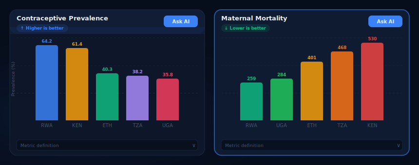

# Health Insights Dashboard

A CXO-facing health analytics dashboard with a governed AI chat copilot, built on WHO Global Health Observatory data.

## Preview





## What it does

- **Static dashboard**: 6 executive charts covering reproductive and maternal health across Rwanda, Kenya, Uganda, Ethiopia, and Tanzania
- **Chart follow-up**: click any chart and ask the AI about it — it explains the metric using the chart's SQL and data provenance
- **New analysis**: ask a freeform question; the AI checks schema, generates SQL, validates it, executes it, and renders a chart
- **Rejection**: out-of-scope questions (cost data, individual records, forecasts) are rejected with a clear reason

## Tech stack

| Layer | Technology |
|-------|-----------|
| Dashboard UI | React 18 + TypeScript + Tailwind + Recharts |
| Backend API | FastAPI + Python 3.12 |
| Database | DuckDB (read-only, WHO GHO data) |
| AI runtime | Claude API (`claude-sonnet-4-6`) |

## Dataset

WHO Global Health Observatory — 6 indicators across 5 East African countries.

| Indicator | WHO Code |
|-----------|----------|
| Contraceptive prevalence | FP_CXUS_W_CURR |
| Maternal mortality ratio | MDG_0000000025 |
| Antenatal care coverage | MDG_0000000031 |
| Skilled birth attendance | MDG_0000000032 |
| Under-5 mortality rate | MDG_0000000001 |
| HIV prevalence | HIV_0000000026 |

Countries: Rwanda (RWA), Kenya (KEN), Uganda (UGA), Ethiopia (ETH), Tanzania (TZA)

## Setup

### Prerequisites
- Python 3.12+
- Anthropic API key

### 1. Clone and install
```bash
git clone https://github.com/naveen-malla/ai-driven-analytics-dashboard
cd ai-driven-analytics-dashboard
python -m venv .venv && source .venv/bin/activate   # Windows: .venv\Scripts\activate
pip install -r requirements.txt
```

### 2. Configure environment
```bash
# Create a .env file in the repo root with:
ANTHROPIC_API_KEY=your_key_here
```

### 3. Load data (run once)
```bash
make load
```

This calls the WHO GHO API and populates `data/who_health.duckdb`. Takes ~30 seconds.

### 4. Install frontend dependencies (once)
```bash
make install-frontend
```

### 5. Run the app
```bash
make backend    # Terminal 1 — FastAPI on :8000
make frontend   # Terminal 2 — React UI on :3000
```

Open [http://localhost:3000](http://localhost:3000)

## Project structure

```
.
├── CLAUDE.md                   ← Project memory (Claude Code reads this)
├── requirements.txt
├── .env                        ← Not committed — add ANTHROPIC_API_KEY here
├── .streamlit/config.toml      ← Streamlit theme
├── .claude/                    ← Agents, skills, hooks config
├── backend/                    ← FastAPI app + Claude API integration
│   ├── main.py                 ← Routes: GET /charts, GET /charts/{id}, POST /chat
│   ├── static_charts.py        ← 6 pre-built chart definitions with WHO SQL
│   ├── sql_validator.py        ← 5-check SQL security layer
│   ├── database.py             ← DuckDB read-only connection
│   ├── schema_loader.py        ← Builds LLM system prompt from schema registry
│   ├── intent_classifier.py    ← Claude structured output → IntentResult
│   └── chat_orchestrator.py    ← Agentic tool-calling loop
├── frontend/                   ← React + TypeScript UI (Vite, Tailwind, Recharts)
│   ├── src/App.tsx             ← Root layout: header + sidebar + chart grid + chat
│   ├── src/components/         ← Header, Sidebar, ChartCard, ChatPanel, MiniChart
│   └── src/lib/                ← types.ts, api.ts
├── dashboard/                  ← Streamlit UI (legacy)
└── data/
    ├── load_who.py             ← WHO GHO API ingestion script (run once)
    ├── schema_registry.json    ← Table/column definitions for LLM context
    ├── benchmark_questions.json← Test questions for AI validation
    └── who_health.duckdb       ← Generated by load_who.py (git-ignored)
```

## Architecture decisions

See [.github/DECISIONS.md](.github/DECISIONS.md)
